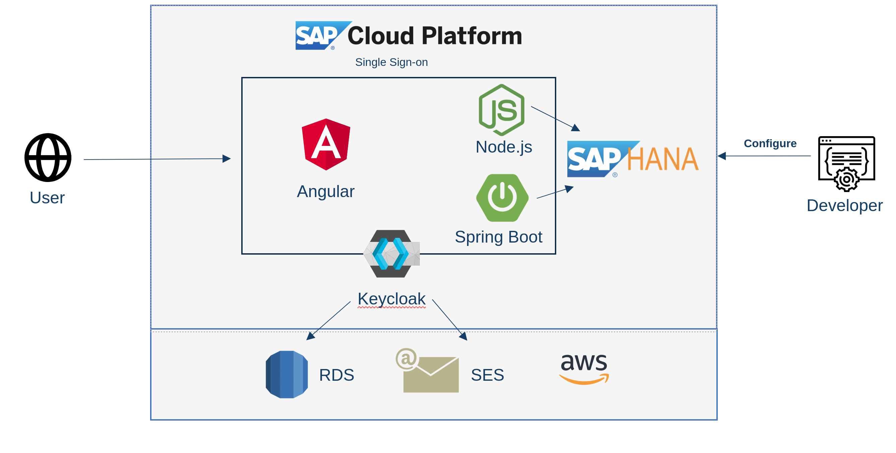
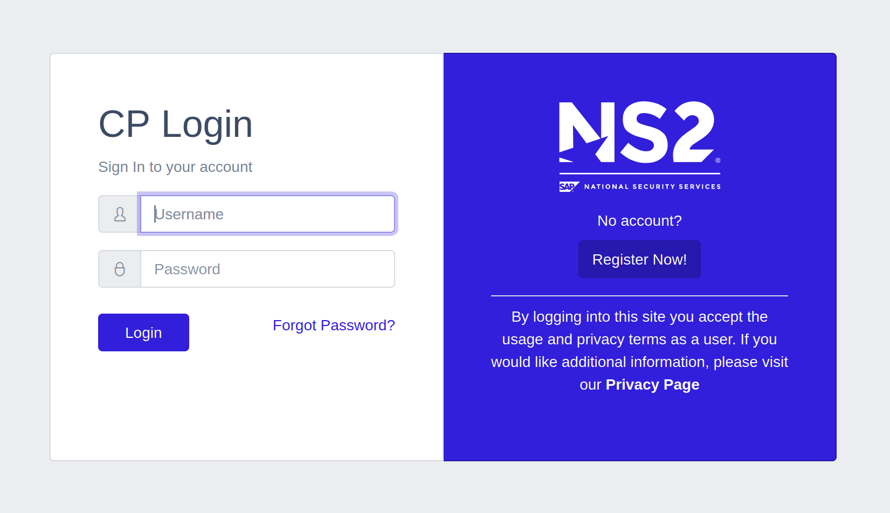

# Cloud Platform - Back to Work Package
**Documentation is WORK IN PROGRESS**  
[SAP Cloud Platform](https://www.sap.com/products/cloud-platform.html) deployable [Keycloak](https://www.keycloak.org/) secured system that deploys multiple microservices that takes advantage of the built in search index, geospatial and text analysis libraries in [SAP HANA](https://www.sap.com/products/hana.html) as well as manage [SAP Cloud Platform Workflows](https://help.sap.com/viewer/product/WORKFLOW_SERVICE/Cloud/en-US) for visitor management

## Requirements
* For deployment on SAP Cloud Platform, a configured [CloudFoundry cli](https://docs.cloudfoundry.org/cf-cli/) with access to a user or [trial](https://www.sap.com/products/cloud-platform.html) account
* For deployment on SAP Cloud Plaform, Keycloak requires a hosted Postgresql backend. Project built with free tier instance from [Amazon RDS](https://aws.amazon.com/rds/)
* Registration email feature in Keycloak requires a sendmail server. Project built with [Amazon SES](https://aws.amazon.com/ses/)

### Development
* [nodejs](https://nodejs.org/en/) environment
* To take advantage of the simplified project deployment scripts you need the following environment variables set. Below are are **example values only**
```bash
export CP_USER=i999111
export CP_PASSWORD=MyAccountPassword55
export PG_ADDR=cp-btwp.random-string-text.us-east-1.rds.amazonaws.com
export PG_PASSWORD=WholeBunchOfCharacters
export KEYCLOAK=false
```



## Keycloak container



* Deployed with `cf-keycloak.sh`
  * Default vendor, user and database are all `postgres`
  * `PG_ADDR` variable is just the hostname or ip address: `sample-app.abcdefg.us-east-1.rds.amazonaws.com`

* Keycloak security is **disabled** by default. Changing the environment variable to **true** enables integration

### Build
* Requires a [PostgreSQL](https://www.postgresql.org/) backend.
  > This project was developed with a free tier [Amazon RDS](https://aws.amazon.com/rds/) instance.
* Run the build script to copy over the custom [CoreUI](https://coreui.io/ ) based theme
```bash
cd keycloak
./docker-build.sh
```
### Run
* Update `keycloak/docker-run.sh` to have the values for your PostgreSQL instance.
  >`PG_ADDR` and `PG_PASSWORD` are externalized to environment variables to avoid being checked into source control

```bash
cd keycloak
./docker-run.sh
```

### Development
* Make sure the keycloak container is running. Get the id of the running container from this command
```bash
docker ps -f ancestor=quay.io/mechevarria/keycloak-coreui | awk '{print $1}'
```
* Copy the over the theme directory from the container by replacing `$container` with the value from the previous command. The system themes are automatically ignored by git
```bash
docker cp $container:/opt/jboss/keycloak/themes keycloak/
```
* Build a development image (turns off caching of pages)
```bash
cd keycloak
./docker-build-dev.sh
```
* Run the development image (mount the local themes directory)
```bash
cd keycloak
./docker-run-dev.sh
```
* Changes made locally to `keycloak/themes` will be seen when you refresh server pages in your browser.

## SAP HANA Container
* Deployed with `cf-db.sh`
* A container named `hdi-hana-deployer` will be created in SAP Cloud Platform to deploy the hana database, populate data and create tables, indexes, etc. The container will then be stopped once complete

## Express Container
> Requires the SAP HANA database container to be deployed. Local development requires the SAP HANA host to whitelist external addresses

### Development
* Inside the `btwp-api` run the following to install all dependencies
```bash
npm install
```

* Start a development server with changes hot deployed
```bash
cd btw-api
./local-run.sh
```

* Deployed with `cf-express-api.sh`
* Change the `KEYCLOAK` environment variable to **true** to enable sso integration

## nginx Angular Container
> Requires the Express container to be deployed
* Deployed with `cf-nginx-angular.sh`
* Change the `KEYCLOAK` environment variable to **true** to enable sso integration